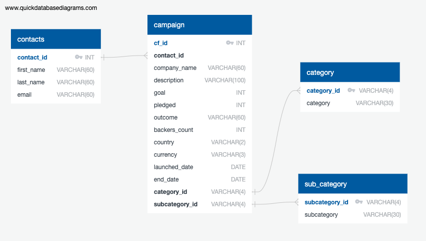

# Crowdfunding_ETL
Crowdfunding_ETL is a collabrative project used to practice ETL skills and database creation for UCB Berkeley Extension's Data Science Bootcamp.

This script takes provided excel data on crowdfunding campaigns and builds an ETL pipeline to transform the data and store it in a SQL database. 

### Category Data clean up
[--]
### Campaign Data clean up
Data was imported from crowdfunding.xlsx found in the Resources folder. Data types were properly formatted, columns properly named, and data merged with category and sub category data to produced a new dataframe of campaign information. Campaign data was exported as campaign.csv found in the Resources folder.

### Contacts Data clean up
[--]

### Database schema
A database was created in pgAdmin4 to store crowdfunding information. Table schema was planned using QuickDBD. Tables were then created using the postgresql query tool and saved as crowd_funding_db_schema.sql. Data was imported using the CSV files found in the Resources folder.

---
Authors - Giulio Chiappolini and Jake Pohs